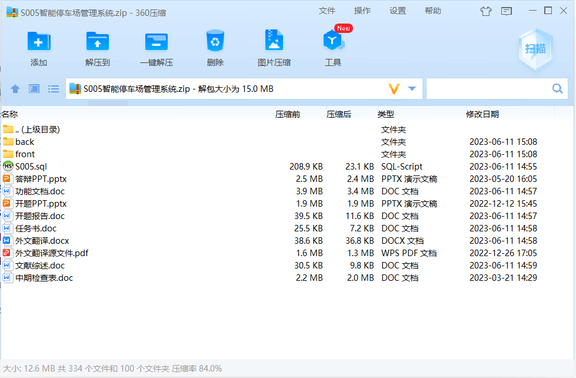
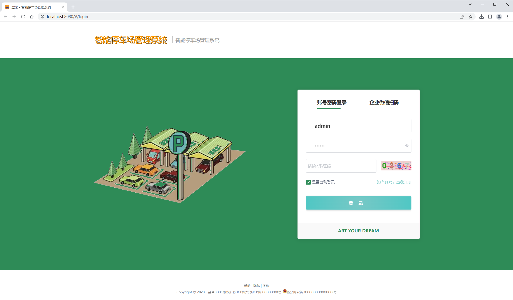
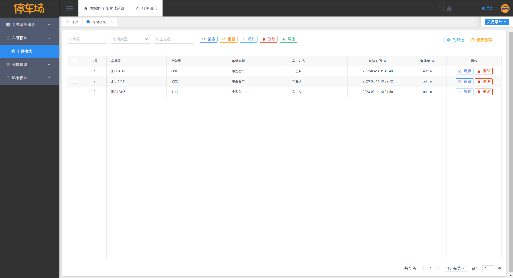
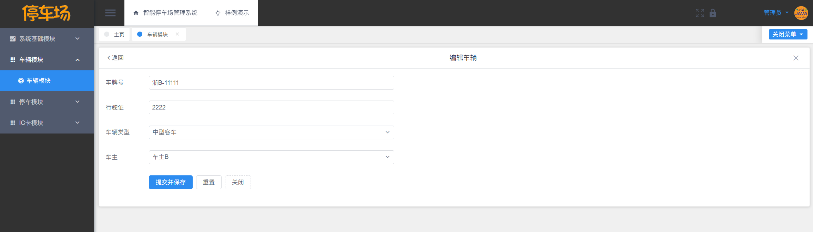
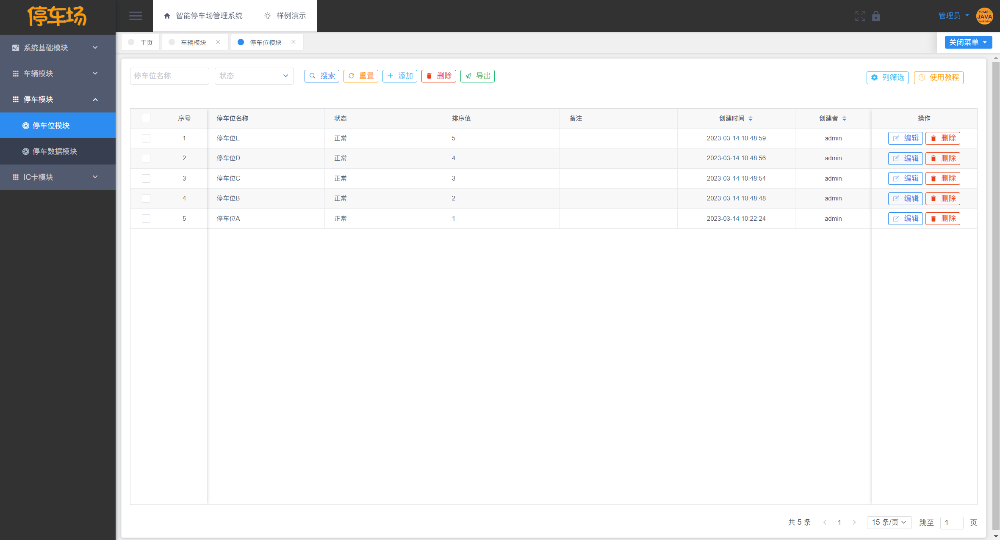
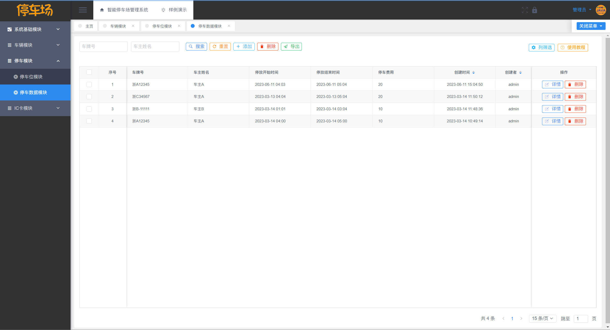
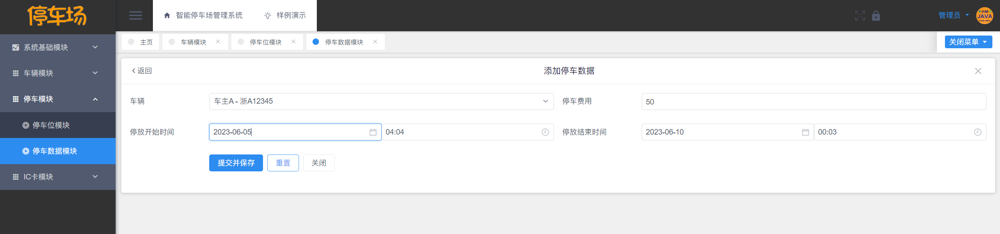
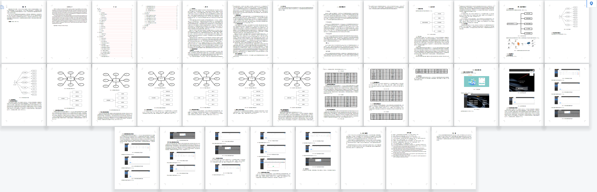
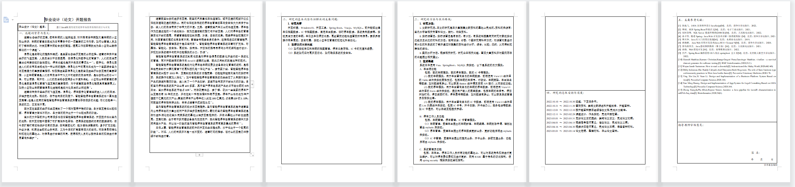

# 智能停车场管理系统

## 软件简介

基于**Vue+SpringBoot+MySQL 的智能停车场管理系统**，包含源码+数据库+功能文档+开题文献+外翻+中检+PPT。

智能停车场管理系统包含的**车主管理模块、车辆管理模块、停车场模块、停车记录模块、IC卡模块、IC卡挂失模块**，还包含系统自带的**用户管理、部门管理、角色管理、菜单管理、日志管理、数据字典管理、文件管理、图表展示**等基础模块，智能停车场管理系统基于角色的访问控制，给车主和停车场管理员使用，可将权限精确到按钮级别，您可以自定义角色并分配权限，系统适合设计精确的权限约束需求。 

高分毕业设计项目，也可作为课程设计、大作业，下载即可使用，无需修改，确保可以直接运行，主要针对计算机相关专业的正在做毕设的学生和需要项目实战的Java学习者，也可作为课程设计、期末大作业。

## 部署说明

本资源仅供个人学习使用，如需获取源码请自助下载，谢谢配合。

| 链接说明       | 对应地址                                                     |
| -------------- | ------------------------------------------------------------ |
| 全套项目下载   | <https://download.csdn.net/download/qq_41464123/87894045>    |
| 文档/答疑讨论  | <https://bbs.csdn.net/topics/615889652>                      |
| B 站录屏预览   | <https://www.bilibili.com/video/BV1eN411k7Sh>                |
| 小红书录屏预览 | <https://www.xiaohongshu.com/explore/64857bdb000000001303f2ad> |
| 知乎录屏预览   | <https://www.zhihu.com/zvideo/1653859682061086722>           |

部署版（本代码仓库）启动说明。

1. 下载 Redis，启动 Redis。
2. 配置好 JDK 和 Maven 的环境变量，具体步骤请百度。
3. 导入 SQL 文件，建议使用 HeidiSQL 导入。
4. 点击 back 目录的 `启动.bat`，启动后端（启动后端前，请务必开启 Redis）。
5. 点击 front 目录的 `启动.bat`，启动前端。

> 若您无法在 Github 中下载 Windows 版 Redis，可以点击 <https://asoa-1305425069.cos.ap-shanghai.myqcloud.com/1670604775470796800.zip> 下载。

源码版的启动教程，可到 <https://edu.csdn.net/course/detail/38632> 中进行学习。

> 若您不愿等 IDEA 自带的 Maven 慢速下载后端依赖，可以从 <https://download.csdn.net/download/qq_41464123/87863346> 下载依赖后替换本地 Maven 仓库。

前端： **Node.js 18，Vue 2.7.10，组件库 View UI 4.7**（如使用低版本 node，需自行降低 plugin 版本）。

后端：**JDK 17 及以上版本，Maven 3.6，SpringBoot 3.1.0，mybatis-plus 3.5.3.1**（因 SpringBoot 3 最低支持 JDK 17，所以项目不支持 JDK 8）。

数据库：**MySQL 8.0.33，Redis 5.0.14**（MySQL5.7 需要手动设置编码 UFT8，并修改 sql 文件编码，否则 a_user 表数据无法导入导致用户不能登录）。

## 免责声明

- 本项目开源，仅供个人学习使用，遵循 GPL-3.0 开源协议，**商用授权请联系作者，否则后果自负**。
- 作者拥有本软件构建后的应用系统全部内容所有权及独立的知识产权。
- 如有问题，欢迎在仓库 Issue 留言，看到后会第一时间回复。相关意见会酌情考虑，但没有一定被采纳的承诺或保证。

下载本系统代码的用户，**必须同意以下内容，否则请勿下载**！

1. 出于自愿而使用/开发本软件，了解使用本软件的风险，且同意自己承担使用本软件的风险。
2. 利用本软件构建的网站的任何信息内容以及导致的任何版权纠纷和法律争议及后果和作者无关，作者对此不承担任何责任。
3. 在任何情况下，对于因使用或无法使用本软件而导致的任何难以合理预估的损失（包括但不仅限于商业利润损失、业务中断与业务信息丢失），作者概不承担任何责任。
4. 必须了解使用本软件的风险，作者不承诺提供一对一的技术支持、使用担保，也不承担任何因本软件而产生的难以预料的问题的相关责任。

## 系统截图

下面是系统截图，相信聪明的读者都能看懂！

